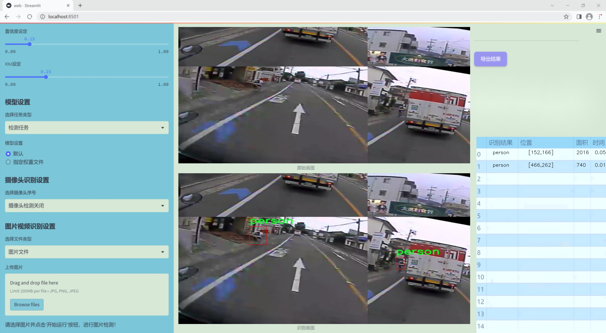
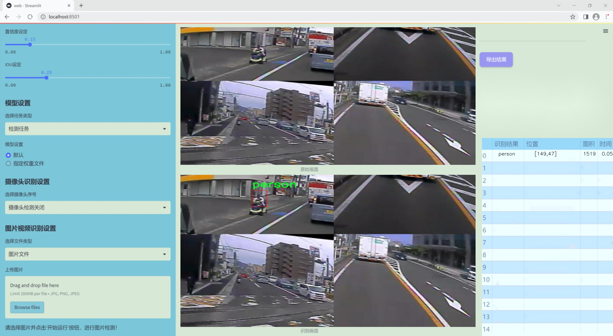
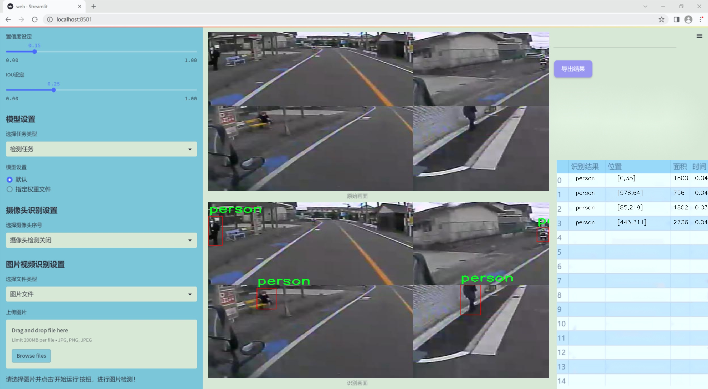
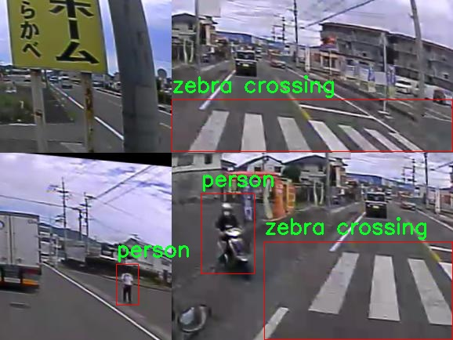
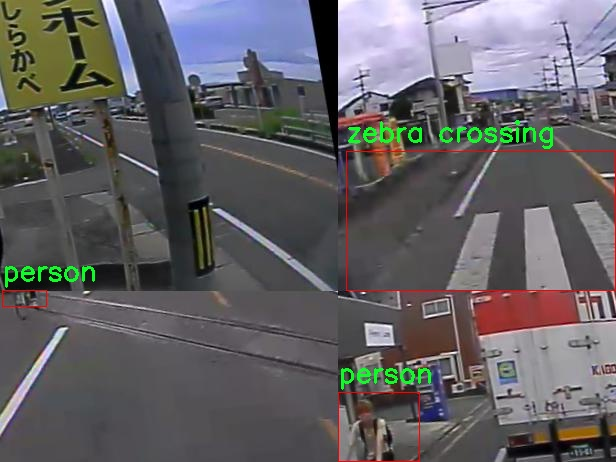
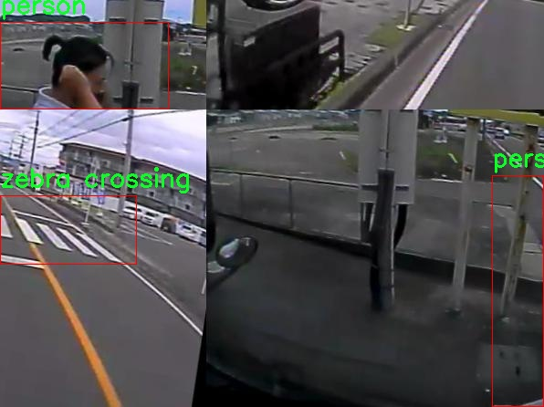

### 1.背景意义

研究背景与意义

随着城市化进程的加快，交通安全问题日益凸显，尤其是行人和斑马线的安全问题引起了广泛关注。行人作为交通参与者之一，其安全性直接关系到城市交通的和谐与稳定。近年来，智能交通系统的快速发展为行人和斑马线的检测提供了新的解决方案。YOLO（You Only Look Once）系列模型因其高效的实时检测能力而受到青睐，其中YOLOv11作为最新版本，进一步提升了检测精度和速度，成为行人和斑马线检测的理想选择。

本研究旨在基于改进的YOLOv11模型，构建一个高效的行人和斑马线检测系统。通过利用4500张图像的数据集，该系统将能够有效识别行人和斑马线，为交通管理和安全监控提供重要支持。数据集中包含的“person”和“zebra crossing”两个类别，能够帮助模型学习到行人与斑马线的特征，从而提高检测的准确性和鲁棒性。

此外，随着深度学习技术的不断进步，改进YOLOv11模型不仅可以提高检测精度，还能在复杂的交通环境中实现实时监控。这对于减少交通事故、提高行人过马路的安全性具有重要意义。通过本研究，期望能够为智能交通系统的建设提供理论支持和技术保障，为城市交通安全管理提供有效的解决方案，从而推动智慧城市的发展。

### 2.视频效果

[2.1 视频效果](https://www.bilibili.com/video/BV1CpmqYzEDB/)

### 3.图片效果







##### [项目涉及的源码数据来源链接](https://kdocs.cn/l/cszuIiCKVNis)**

注意：本项目提供训练的数据集和训练教程,由于版本持续更新,暂不提供权重文件（best.pt）,请按照6.训练教程进行训练后实现上图演示的效果。

### 4.数据集信息

##### 4.1 本项目数据集类别数＆类别名

nc: 3
names: ['d', 'person', 'zebra crossing']


该项目为【目标检测】数据集，请在【训练教程和Web端加载模型教程（第三步）】这一步的时候按照【目标检测】部分的教程来训练

##### 4.2 本项目数据集信息介绍

本项目数据集信息介绍

本项目所使用的数据集是为了解决特定领域内的图像识别和分类问题而精心构建的。该数据集包含了来自多个来源的高质量图像，涵盖了多种类别和场景，旨在为深度学习模型的训练提供丰富的样本支持。数据集中的图像经过严格筛选和标注，确保每一张图像都具备准确的标签信息，以便于后续的模型训练和评估。

数据集的构建过程遵循了标准的数据采集和处理流程。首先，通过网络爬虫技术从多个开放资源中获取了大量的图像数据，随后对这些图像进行了去重和清洗，以保证数据的独特性和有效性。接着，专业的标注团队对图像进行了详细的标注工作，确保每个类别的样本数量均衡，涵盖了不同的拍摄角度、光照条件和背景环境，从而提高模型的泛化能力。

此外，为了增强数据集的多样性，我们还采用了数据增强技术，包括旋转、缩放、翻转等多种变换方式，以生成更多的训练样本。这种方法不仅丰富了数据集的内容，还有效地提高了模型在面对不同场景时的鲁棒性。

数据集的设计目标是为研究人员和开发者提供一个可靠的基础，以便于他们在图像识别领域进行深入的研究和开发。通过使用该数据集，研究人员可以更好地理解不同算法在实际应用中的表现，并为未来的研究提供有价值的参考和数据支持。整体而言，本项目的数据集在质量、数量和多样性上都达到了较高的标准，期待能为相关领域的研究贡献力量。








### 5.全套项目环境部署视频教程（零基础手把手教学）

[5.1 所需软件PyCharm和Anaconda安装教程（第一步）](https://www.bilibili.com/video/BV1BoC1YCEKi/?spm_id_from=333.999.0.0&vd_source=bc9aec86d164b67a7004b996143742dc)


[5.2 安装Python虚拟环境创建和依赖库安装视频教程（第二步）](https://www.bilibili.com/video/BV1ZoC1YCEBw?spm_id_from=333.788.videopod.sections&vd_source=bc9aec86d164b67a7004b996143742dc)

### 6.改进YOLOv11训练教程和Web_UI前端加载模型教程（零基础手把手教学）

[6.1 改进YOLOv11训练教程和Web_UI前端加载模型教程（第三步）](https://www.bilibili.com/video/BV1BoC1YCEhR?spm_id_from=333.788.videopod.sections&vd_source=bc9aec86d164b67a7004b996143742dc)


按照上面的训练视频教程链接加载项目提供的数据集，运行train.py即可开始训练



     Epoch   gpu_mem       box       obj       cls    labels  img_size
     1/200     20.8G   0.01576   0.01955  0.007536        22      1280: 100%|██████████| 849/849 [14:42<00:00,  1.04s/it]
               Class     Images     Labels          P          R     mAP@.5 mAP@.5:.95: 100%|██████████| 213/213 [01:14<00:00,  2.87it/s]
                 all       3395      17314      0.994      0.957      0.0957      0.0843

     Epoch   gpu_mem       box       obj       cls    labels  img_size
     2/200     20.8G   0.01578   0.01923  0.007006        22      1280: 100%|██████████| 849/849 [14:44<00:00,  1.04s/it]
               Class     Images     Labels          P          R     mAP@.5 mAP@.5:.95: 100%|██████████| 213/213 [01:12<00:00,  2.95it/s]
                 all       3395      17314      0.996      0.956      0.0957      0.0845

     Epoch   gpu_mem       box       obj       cls    labels  img_size
     3/200     20.8G   0.01561    0.0191  0.006895        27      1280: 100%|██████████| 849/849 [10:56<00:00,  1.29it/s]
               Class     Images     Labels          P          R     mAP@.5 mAP@.5:.95: 100%|███████   | 187/213 [00:52<00:00,  4.04it/s]
                 all       3395      17314      0.996      0.957      0.0957      0.0845


###### [项目数据集下载链接](https://kdocs.cn/l/cszuIiCKVNis)

### 7.原始YOLOv11算法讲解

YOLOv11是Ultralytics推出的YOLO系列最新版本，专为实现尖端的物体检测而设计。其架构和训练方法上进行了重大改进，使之不仅具备卓越的准确性和处理速度，还在计算效率上实现了一场革命。得益于其改进的主干和颈部架构，YOLOv11在特征提取和处理复杂任务时表现更加出色。在2024年9月27日，Ultralytics通过长达九小时的在线直播发布这一新作，展示了其在计算机视觉领域的革新。

YOLOv11通过精细的架构设计和优化训练流程，在保持高精度的同时，缩减了参数量，与YOLOv8m相比减少了22%的参数，使其在COCO数据集上的平均准确度（mAP）有所提升。这种效率的提高使YOLOv11非常适合部署在各种硬件环境中，包括边缘设备、云计算平台以及支持NVIDIA GPU的系统，确保在灵活性上的优势。

该模型支持广泛的任务，从对象检测、实例分割到图像分类、姿态估计和定向对象检测（OBB），几乎覆盖了计算机视觉的所有主要挑战。其创新的C3k2和C2PSA模块提升了网络深度和注意力机制的应用，提高了特征提取的效率和效果。同时，YOLOv11的改进网络结构也使之在复杂视觉任务上得以从容应对，成为各类计算机视觉任务的多功能选择。这些特性令YOLOv11在实施实时物体检测的各个领域中表现出众。
* * *

2024年9月27日，Ultralytics在线直播长达九小时，为YOLO11召开“发布会”

YOLO11 是 Ultralytics YOLO 系列实时物体检测器的最新版本，它以尖端的准确性、速度和效率重新定义了可能性。在之前 YOLO
版本的显著进步的基础上，YOLO11 在架构和训练方法方面进行了重大改进，使其成为各种计算机视觉任务的多功能选择。


##### YOLO11主要特点：

  * 增强的特征提取：YOLO11 采用了改进的主干和颈部架构，增强了特征提取能力，可实现更精确的对象检测和复杂任务性能。
  * 针对效率和速度进行了优化：YOLO11 引入了完善的架构设计和优化的训练流程，可提供更快的处理速度，并在准确度和性能之间保持最佳平衡。
  * 更少的参数，更高的准确度：借助模型设计的进步，YOLO11m 在 COCO 数据集上实现了更高的平均准确度 (mAP)，同时使用的参数比 YOLOv8m 少 22%，从而提高了计算效率，同时又不影响准确度。
  * 跨环境的适应性：YOLO11 可以无缝部署在各种环境中，包括边缘设备、云平台和支持 NVIDIA GPU 的系统，从而确保最大的灵活性。
  * 支持的任务范围广泛：无论是对象检测、实例分割、图像分类、姿势估计还是定向对象检测 (OBB)，YOLO11 都旨在满足各种计算机视觉挑战。

##### 支持的任务和模式

YOLO11 以 YOLOv8 中引入的多功能模型系列为基础，为各种计算机视觉任务提供增强的支持：

Model| Filenames| Task| Inference| Validation| Training| Export  
---|---|---|---|---|---|---  
YOLO11| yolol11n.pt, yolol11s.pt, yolol11m.pt, yolol11x.pt| Detection| ✅| ✅|
✅| ✅  
YOLO11-seg| yolol11n-seg.pt, yolol11s-seg.pt, yolol11m-seg.pt,
yolol11x-seg.pt| Instance Segmentation| ✅| ✅| ✅| ✅  
YOLO11-pose| yolol11n-pose.pt, yolol11s-pose.pt, yolol11m-pose.pt,
yolol11x-pose.pt| Pose/Keypoints| ✅| ✅| ✅| ✅  
YOLO11-obb| yolol11n-obb.pt, yolol11s-obb.pt, yolol11m-obb.pt,
yolol11x-obb.pt| Oriented Detection| ✅| ✅| ✅| ✅  
YOLO11-cls| yolol11n-cls.pt, yolol11s-cls.pt, yolol11m-cls.pt,
yolol11x-cls.pt| Classification| ✅| ✅| ✅| ✅  
  
##### 简单的 YOLO11 训练和推理示例

以下示例适用于用于对象检测的 YOLO11 Detect 模型。

    
    
    from ultralytics import YOLO
    
    # Load a model
    model = YOLO("yolo11n.pt")
    
    # Train the model
    train_results = model.train(
        data="coco8.yaml",  # path to dataset YAML
        epochs=100,  # number of training epochs
        imgsz=640,  # training image size
        device="cpu",  # device to run on, i.e. device=0 or device=0,1,2,3 or device=cpu
    )
    
    # Evaluate model performance on the validation set
    metrics = model.val()
    
    # Perform object detection on an image
    results = model("path/to/image.jpg")
    results[0].show()
    
    # Export the model to ONNX format
    path = model.export(format="onnx")  # return path to exported model

##### 支持部署于边缘设备

YOLO11 专为适应各种环境而设计，包括边缘设备。其优化的架构和高效的处理能力使其适合部署在边缘设备、云平台和支持 NVIDIA GPU
的系统上。这种灵活性确保 YOLO11 可用于各种应用，从移动设备上的实时检测到云环境中的复杂分割任务。有关部署选项的更多详细信息，请参阅导出文档。

##### YOLOv11 yaml文件

    
    
    # Ultralytics YOLO 🚀, AGPL-3.0 license
    # YOLO11 object detection model with P3-P5 outputs. For Usage examples see https://docs.ultralytics.com/tasks/detect
    
    # Parameters
    nc: 80 # number of classes
    scales: # model compound scaling constants, i.e. 'model=yolo11n.yaml' will call yolo11.yaml with scale 'n'
      # [depth, width, max_channels]
      n: [0.50, 0.25, 1024] # summary: 319 layers, 2624080 parameters, 2624064 gradients, 6.6 GFLOPs
      s: [0.50, 0.50, 1024] # summary: 319 layers, 9458752 parameters, 9458736 gradients, 21.7 GFLOPs
      m: [0.50, 1.00, 512] # summary: 409 layers, 20114688 parameters, 20114672 gradients, 68.5 GFLOPs
      l: [1.00, 1.00, 512] # summary: 631 layers, 25372160 parameters, 25372144 gradients, 87.6 GFLOPs
      x: [1.00, 1.50, 512] # summary: 631 layers, 56966176 parameters, 56966160 gradients, 196.0 GFLOPs
    
    # YOLO11n backbone
    backbone:
      # [from, repeats, module, args]
      - [-1, 1, Conv, [64, 3, 2]] # 0-P1/2
      - [-1, 1, Conv, [128, 3, 2]] # 1-P2/4
      - [-1, 2, C3k2, [256, False, 0.25]]
      - [-1, 1, Conv, [256, 3, 2]] # 3-P3/8
      - [-1, 2, C3k2, [512, False, 0.25]]
      - [-1, 1, Conv, [512, 3, 2]] # 5-P4/16
      - [-1, 2, C3k2, [512, True]]
      - [-1, 1, Conv, [1024, 3, 2]] # 7-P5/32
      - [-1, 2, C3k2, [1024, True]]
      - [-1, 1, SPPF, [1024, 5]] # 9
      - [-1, 2, C2PSA, [1024]] # 10
    
    # YOLO11n head
    head:
      - [-1, 1, nn.Upsample, [None, 2, "nearest"]]
      - [[-1, 6], 1, Concat, [1]] # cat backbone P4
      - [-1, 2, C3k2, [512, False]] # 13
    
      - [-1, 1, nn.Upsample, [None, 2, "nearest"]]
      - [[-1, 4], 1, Concat, [1]] # cat backbone P3
      - [-1, 2, C3k2, [256, False]] # 16 (P3/8-small)
    
      - [-1, 1, Conv, [256, 3, 2]]
      - [[-1, 13], 1, Concat, [1]] # cat head P4
      - [-1, 2, C3k2, [512, False]] # 19 (P4/16-medium)
    
      - [-1, 1, Conv, [512, 3, 2]]
      - [[-1, 10], 1, Concat, [1]] # cat head P5
      - [-1, 2, C3k2, [1024, True]] # 22 (P5/32-large)
    
      - [[16, 19, 22], 1, Detect, [nc]] # Detect(P3, P4, P5)
    

**YOLO11和YOLOv8 yaml文件的区别**


##### 改进模块代码

  * C3k2 

    
    
    class C3k2(C2f):
        """Faster Implementation of CSP Bottleneck with 2 convolutions."""
    
        def __init__(self, c1, c2, n=1, c3k=False, e=0.5, g=1, shortcut=True):
            """Initializes the C3k2 module, a faster CSP Bottleneck with 2 convolutions and optional C3k blocks."""
            super().__init__(c1, c2, n, shortcut, g, e)
            self.m = nn.ModuleList(
                C3k(self.c, self.c, 2, shortcut, g) if c3k else Bottleneck(self.c, self.c, shortcut, g) for _ in range(n)
            )

C3k2，它是具有两个卷积的CSP（Partial Cross Stage）瓶颈架构的更快实现。

**类继承：**

  * `C3k2`继承自类`C2f`。这表明`C2f`很可能实现了经过修改的基本CSP结构，而`C3k2`进一步优化或修改了此结构。

**构造函数（`__init__`）：**

  * `c1`：输入通道。

  * `c2`：输出通道。

  * `n`：瓶颈层数（默认为1）。

  * `c3k`：一个布尔标志，确定是否使用`C3k`块或常规`Bottleneck`块。

  * `e`：扩展比率，控制隐藏层的宽度（默认为0.5）。

  * `g`：分组卷积的组归一化参数或组数（默认值为 1）。

  * `shortcut`：一个布尔值，用于确定是否在网络中包含快捷方式连接（默认值为 `True`）。

**初始化：**

  * `super().__init__(c1, c2, n, short-cut, g, e)` 调用父类 `C2f` 的构造函数，初始化标准 CSP 组件，如通道数、快捷方式、组等。

**模块列表（`self.m`）：**

  * `nn.ModuleList` 存储 `C3k` 或 `Bottleneck` 模块，具体取决于 `c3k` 的值。

  * 如果 `c3k` 为 `True`，它会初始化 `C3k` 模块。`C3k` 模块接收以下参数：

  * `self.c`：通道数（源自 `C2f`）。

  * `2`：这表示在 `C3k` 块内使用了两个卷积层。

  * `shortcut` 和 `g`：从 `C3k2` 构造函数传递。

  * 如果 `c3k` 为 `False`，则初始化标准 `Bottleneck` 模块。

`for _ in range(n)` 表示将创建 `n` 个这样的块。

**总结：**

  * `C3k2` 实现了 CSP 瓶颈架构，可以选择使用自定义 `C3k` 块（具有两个卷积）或标准 `Bottleneck` 块，具体取决于 `c3k` 标志。

  * C2PSA

    
    
    class C2PSA(nn.Module):
        """
        C2PSA module with attention mechanism for enhanced feature extraction and processing.
    
        This module implements a convolutional block with attention mechanisms to enhance feature extraction and processing
        capabilities. It includes a series of PSABlock modules for self-attention and feed-forward operations.
    
        Attributes:
            c (int): Number of hidden channels.
            cv1 (Conv): 1x1 convolution layer to reduce the number of input channels to 2*c.
            cv2 (Conv): 1x1 convolution layer to reduce the number of output channels to c.
            m (nn.Sequential): Sequential container of PSABlock modules for attention and feed-forward operations.
    
        Methods:
            forward: Performs a forward pass through the C2PSA module, applying attention and feed-forward operations.
    
        Notes:
            This module essentially is the same as PSA module, but refactored to allow stacking more PSABlock modules.
    
        Examples:
            >>> c2psa = C2PSA(c1=256, c2=256, n=3, e=0.5)
            >>> input_tensor = torch.randn(1, 256, 64, 64)
            >>> output_tensor = c2psa(input_tensor)
        """
    
        def __init__(self, c1, c2, n=1, e=0.5):
            """Initializes the C2PSA module with specified input/output channels, number of layers, and expansion ratio."""
            super().__init__()
            assert c1 == c2
            self.c = int(c1 * e)
            self.cv1 = Conv(c1, 2 * self.c, 1, 1)
            self.cv2 = Conv(2 * self.c, c1, 1)
    
            self.m = nn.Sequential(*(PSABlock(self.c, attn_ratio=0.5, num_heads=self.c // 64) for _ in range(n)))
    
        def forward(self, x):
            """Processes the input tensor 'x' through a series of PSA blocks and returns the transformed tensor."""
            a, b = self.cv1(x).split((self.c, self.c), dim=1)
            b = self.m(b)
            return self.cv2(torch.cat((a, b), 1))

`C2PSA` 模块是一个自定义神经网络层，带有注意力机制，用于增强特征提取和处理。

**类概述**

  * **目的：**

  * `C2PSA` 模块引入了一个卷积块，利用注意力机制来改进特征提取和处理。

  * 它使用一系列 `PSABlock` 模块，这些模块可能代表某种形式的位置自注意力 (PSA)，并且该架构旨在允许堆叠多个 `PSABlock` 层。

**构造函数（`__init__`）：**

  * **参数：**

  * `c1`：输入通道（必须等于 `c2`）。

  * `c2`：输出通道（必须等于 `c1`）。

  * `n`：要堆叠的 `PSABlock` 模块数量（默认值为 1）。

  * `e`：扩展比率，用于计算隐藏通道的数量（默认值为 0.5）。

  * **属性：**

  * `self.c`：隐藏通道数，计算为 `int(c1 * e)`。

  * `self.cv1`：一个 `1x1` 卷积，将输入通道数从 `c1` 减少到 `2 * self.c`。这为将输入分成两部分做好准备。

  * `self.cv2`：另一个 `1x1` 卷积，处理后将通道维度恢复回 `c1`。

  * `self.m`：一系列 `PSABlock` 模块。每个 `PSABlock` 接收 `self.c` 通道，注意头的数量为 `self.c // 64`。每个块应用注意和前馈操作。

**前向方法：**

  * **输入：**

  * `x`，输入张量。

  * **操作：**

  1. `self.cv1(x)` 应用 `1x1` 卷积，将输入通道大小从 `c1` 减小到 `2 * self.c`。

  2. 生成的张量沿通道维度分为两部分，`a` 和 `b`。

  * `a`：第一个 `self.c` 通道。

  * `b`：剩余的 `self.c` 通道。

  1. `b` 通过顺序容器 `self.m`，它是 `PSABlock` 模块的堆栈。这部分经过基于注意的处理。

  2. 处理后的张量 `b` 与 `a` 连接。

  3. `self.cv2` 应用 `1x1` 卷积，将通道大小恢复为 `c1`。

  * **输出：**

  * 应用注意和卷积操作后的变换后的张量。

**总结：**

  * **C2PSA** 是一个增强型卷积模块，它通过堆叠的 `PSABlock` 模块应用位置自注意力。它拆分输入张量，将注意力应用于其中一部分，然后重新组合并通过最终卷积对其进行处理。此结构有助于从输入数据中提取复杂特征。

##### 网络结构


### 8.200+种全套改进YOLOV11创新点原理讲解

#### 8.1 200+种全套改进YOLOV11创新点原理讲解大全

由于篇幅限制，每个创新点的具体原理讲解就不全部展开，具体见下列网址中的改进模块对应项目的技术原理博客网址【Blog】（创新点均为模块化搭建，原理适配YOLOv5~YOLOv11等各种版本）

[改进模块技术原理博客【Blog】网址链接](https://gitee.com/qunmasj/good)


#### 8.2 精选部分改进YOLOV11创新点原理讲解

###### 这里节选部分改进创新点展开原理讲解(完整的改进原理见上图和[改进模块技术原理博客链接](https://gitee.com/qunmasj/good)【如果此小节的图加载失败可以通过CSDN或者Github搜索该博客的标题访问原始博客，原始博客图片显示正常】


### 感受野注意力卷积（RFAConv)
#### 标准卷积操作回顾
标准的卷积操作是构造卷积神经网络的基本构件。它利用具有共享参数的滑动窗口提取特征信息，克服了全连通层构造神经网络固有的参数多、计算开销大的问题。设 X R∈C×H×W
表示输入特征图，其中C、H、W分别表示特征图的通道数、高度、宽度。为了清楚地演示卷积核的特征提取过程，我们使用 C = 1 的例子。从每个接受域滑块中提取特征信息的卷积运算可以表示为:


这里，Fi 表示计算后每个卷积滑块得到的值，Xi 表示每个滑块内对应位置的像素值，K表示卷积核，S表示卷积核中的参数个数，N表示接收域滑块的总数。可以看出，每个滑块内相同位置的 feature共享相同的参数Ki。因此，标准的卷积运算并不能捕捉到不同位置所带来的信息差异，这最终在一定程度上限制了卷积神经网络的性能。 

#### 空间注意力回顾
目前，空间注意机制是利用学习得到的注意图来突出每个特征的重要性。与前一节类似，这里以 C=1为例。突出关键特征的空间注意机制可以简单表述为:这里，Fi 表示加权运算后得到的值。xi 和Ai 表示输入特征图和学习到的注意图在不同位置的值，N为输入特征图的高和宽的乘积，表示像素值的总数。


#### 空间注意与标准卷积运算
将注意力机制整合到卷积神经网络中，可以提高卷积神经网络的性能。通过对标准卷积运算和现有空间注意机制的研究，我们认为空间注意机制有效地克服了卷积神经网络固有的参数共享的局限性。目前卷积神经网络中最常用的核大小是 1 × 1和3 × 3。在引入空间注意机制后，提取特征的卷积操作可以是 1 × 1或3 × 3卷积操作。为了直观地展示这个过程，在 1 × 1卷积运算的前面插入了空间注意机制。通过注意图对输入特征图(Re-weight“×”)进行加权运算，最后通过 1 × 1卷积运算提取接收域的滑块特征信息。整个过程可以简单地表示如下:


 这里卷积核K仅代表一个参数值。如果取A i× ki 的值作为一种新的卷积核参数，有趣的是它解决了 1×1卷积运算提取特征时的参数共享问题。然而，关于空间注意机制的传说到此结束。当空间注意机制被插入到3×3卷积运算前面时。具体情况如下:


如上所述，如果取A的值 i × ki (4)式作为一种新的卷积核参数，完全解决了大规模卷积核的参数共享问题。然而，最重要的一点是，卷积核在提取每个接受域滑块的特征时，会共享一些特征。换句话说，每个接收域滑块内都有一个重叠。仔细分析后会发现A12= a21， a13 = a22， a15 = a24……，在这种情况下，每个滑动窗口共享空间注意力地图的权重。因此，空间注意机制没有考虑整个接受域的空间特征，不能有效地解决大规模卷积核的参数共享问题。因此，空间注意机制的有效性受到限制。 

#### 创新空间注意力和标准卷积操作
该博客提出解决了现有空间注意机制的局限性，为空间处理提供了一种创新的解决方案。受RFA的启发，一系列空间注意机制被开发出来，可以进一步提高卷积神经网络的性能。RFA可以看作是一个轻量级即插即用模块，RFA设计的卷积运算(RFAConv)可以代替标准卷积来提高卷积神经网络的性能。因此，我们预测空间注意机制与标准卷积运算的结合将继续发展，并在未来带来新的突破。
接受域空间特征:为了更好地理解接受域空间特征的概念，我们将提供相关的定义。接收域空间特征是专门为卷积核设计的，并根据核大小动态生成。如图1所示，以3×3卷积核为例。在图1中，“Spatial Feature”指的是原始的Feature map。“接受域空间特征”是空间特征变换后的特征图。

 

由不重叠的滑动窗口组成。当使用 3×3卷积内核提取特征时，接收域空间特征中的每个 3×3大小窗口代表一个接收域滑块。接受域注意卷积(RFAConv):针对接受域的空间特征，我们提出了接受域注意卷积(RFA)。该方法不仅强调了接收域滑块内不同特征的重要性，而且对接收域空间特征进行了优先排序。通过该方法，完全解决了卷积核参数共享的问题。接受域空间特征是根据卷积核的大小动态生成的，因此，RFA是卷积的固定组合，不能与卷积操作的帮助分离，卷积操作同时依赖于RFA来提高性能，因此我们提出了接受场注意卷积(RFAConv)。具有3×3大小的卷积核的RFAConv整体结构如图所示。


目前，最广泛使用的接受域特征提取方法是缓慢的。经过大量的研究，我们开发了一种快速的方法，用分组卷积来代替原来的方法。具体来说，我们利用相应大小的分组卷积来动态生成基于接受域大小的展开特征。尽管与原始的无参数方法(如PyTorch提供的nn.())相比，该方法增加了一些参数，但它的速度要快得多。注意:如前一节所述，当使用 3×3卷积内核提取特征时，接收域空间特征中的每个 3×3大小窗口表示一个接收域滑块。而利用快速分组卷积提取感受野特征后，将原始特征映射为新的特征。最近的研究表明。交互信息可以提高网络性能，如[40,41,42]所示。同样，对于RFAConv来说，通过交互接受域特征信息来学习注意图可以提高网络性能。然而，与每个接收域特征交互会导致额外的计算开销，因此为了最小化计算开销和参数的数量，我们使用AvgPool来聚合每个接收域特征的全局信息。然后，使用 1×1 组卷积操作进行信息交互。最后，我们使用softmax来强调每个特征在接受域特征中的重要性。一般情况下，RFA的计算可以表示为:


这里gi×i 表示一个大小为 i×i的分组卷积，k表示卷积核的大小，Norm表示归一化，X表示输入的特征图，F由注意图 a相乘得到 rf 与转换后的接受域空间特征 Frf。与CBAM和CA不同，RFA能够为每个接受域特征生成注意图。卷积神经网络的性能受到标准卷积操作的限制，因为卷积操作依赖于共享参数，对位置变化带来的信息差异不敏感。然而，RFAConv通过强调接收域滑块中不同特征的重要性，并对接收域空间特征进行优先级排序，可以完全解决这个问题。通过RFA得到的feature map是接受域空间特征，在“Adjust Shape”后没有重叠。因此，学习到的注意图将每个接受域滑块的特征信息聚合起来。换句话说，注意力地图不再共享在每个接受域滑块。这完全弥补了现有 CA和CBAM注意机制的不足。RFA为标准卷积内核提供了显著的好处。而在调整形状后，特征的高度和宽度是 k倍，需要进行 stride = k的k × k卷积运算来提取特征信息。RFA设计的卷积运算RFAConv为卷积带来了良好的增益，对标准卷积进行了创新。
此外，我们认为现有的空间注意机制应该优先考虑接受域空间特征，以提高网络性能。众所周知，基于自注意机制的网络模型[43,44,45]取得了很大的成功，因为它解决了卷积参数共享的问题，并对远程信息进行建模。然而，自注意机制也为模型引入了显著的计算开销和复杂性。我们认为，将现有的空间注意机制的注意力引导到接受场空间特征上，可以以类似于自我注意的方式解决长期信息的参数共享和建模问题。与自我关注相比，这种方法需要的参数和计算资源少得多。答案如下:(1)将以接收场空间特征为中心的空间注意机制与卷积相结合，消除了卷积参数共享的问题。(2)现有的空间注意机制已经考虑了远程信息，可以通过全局平均池或全局最大池的方式获取全局信息，其中明确考虑了远程信息。因此，我们设计了新的 CBAM和CA模型，称为RFCBAM和RFCA，它们专注于接受域空间特征。与RFA类似，使用最终的k × k stride = k 的卷积运算来提取特征信息。这两种新的卷积方法的具体结构如图 3所示，我们称这两种新的卷积操作为 RFCBAMConv和RFCAConv。与原来的CBAM相比，我们在RFCBAM中使用SE attention来代替CAM。因为这样可以减少计算开销。此外，在RFCBAM中，通道注意和空间注意不是分开执行的。相反，它们是同时加权的，使得每个通道获得的注意力地图是不同的。


### 9.系统功能展示

图9.1.系统支持检测结果表格显示

  图9.2.系统支持置信度和IOU阈值手动调节

  图9.3.系统支持自定义加载权重文件best.pt(需要你通过步骤5中训练获得)

  图9.4.系统支持摄像头实时识别

  图9.5.系统支持图片识别

  图9.6.系统支持视频识别

  图9.7.系统支持识别结果文件自动保存

  图9.8.系统支持Excel导出检测结果数据


### 10. YOLOv11核心改进源码讲解

#### 10.1 hcfnet.py

以下是对代码中最核心部分的提取和详细中文注释：

```python
import math
import torch
import torch.nn as nn
import torch.nn.functional as F

# 定义空间注意力模块
class SpatialAttentionModule(nn.Module):
    def __init__(self):
        super(SpatialAttentionModule, self).__init__()
        # 2通道输入，1通道输出的卷积层
        self.conv2d = nn.Conv2d(in_channels=2, out_channels=1, kernel_size=7, stride=1, padding=3)
        self.sigmoid = nn.Sigmoid()  # Sigmoid激活函数

    def forward(self, x):
        # 计算输入的平均值和最大值
        avgout = torch.mean(x, dim=1, keepdim=True)  # 平均池化
        maxout, _ = torch.max(x, dim=1, keepdim=True)  # 最大池化
        out = torch.cat([avgout, maxout], dim=1)  # 将平均值和最大值拼接
        out = self.sigmoid(self.conv2d(out))  # 通过卷积和Sigmoid激活
        return out * x  # 将注意力权重应用于输入

# 定义局部-全局注意力模块
class LocalGlobalAttention(nn.Module):
    def __init__(self, output_dim, patch_size):
        super().__init__()
        self.output_dim = output_dim
        self.patch_size = patch_size
        self.mlp1 = nn.Linear(patch_size * patch_size, output_dim // 2)  # MLP层
        self.norm = nn.LayerNorm(output_dim // 2)  # 层归一化
        self.mlp2 = nn.Linear(output_dim // 2, output_dim)  # MLP层
        self.conv = nn.Conv2d(output_dim, output_dim, kernel_size=1)  # 1x1卷积
        self.prompt = torch.nn.parameter.Parameter(torch.randn(output_dim, requires_grad=True))  # 可学习的参数
        self.top_down_transform = torch.nn.parameter.Parameter(torch.eye(output_dim), requires_grad=True)  # 可学习的参数

    def forward(self, x):
        x = x.permute(0, 2, 3, 1)  # 调整维度顺序
        B, H, W, C = x.shape  # 获取批量大小、高度、宽度和通道数
        P = self.patch_size

        # 局部分支
        local_patches = x.unfold(1, P, P).unfold(2, P, P)  # 提取局部patch
        local_patches = local_patches.reshape(B, -1, P * P, C)  # 重塑形状
        local_patches = local_patches.mean(dim=-1)  # 对每个patch进行平均

        local_patches = self.mlp1(local_patches)  # 通过MLP
        local_patches = self.norm(local_patches)  # 归一化
        local_patches = self.mlp2(local_patches)  # 通过MLP

        local_attention = F.softmax(local_patches, dim=-1)  # 计算局部注意力
        local_out = local_patches * local_attention  # 应用注意力

        # 计算余弦相似度
        cos_sim = F.normalize(local_out, dim=-1) @ F.normalize(self.prompt[None, ..., None], dim=1)  # 计算相似度
        mask = cos_sim.clamp(0, 1)  # 限制在[0, 1]范围内
        local_out = local_out * mask  # 应用mask
        local_out = local_out @ self.top_down_transform  # 应用变换

        # 恢复形状
        local_out = local_out.reshape(B, H // P, W // P, self.output_dim)  # 重塑形状
        local_out = local_out.permute(0, 3, 1, 2)  # 调整维度顺序
        local_out = F.interpolate(local_out, size=(H, W), mode='bilinear', align_corners=False)  # 上采样
        output = self.conv(local_out)  # 通过卷积层

        return output  # 返回输出

# 定义ECA模块
class ECA(nn.Module):
    def __init__(self, in_channel, gamma=2, b=1):
        super(ECA, self).__init__()
        k = int(abs((math.log(in_channel, 2) + b) / gamma))  # 计算卷积核大小
        kernel_size = k if k % 2 else k + 1  # 确保卷积核大小为奇数
        padding = kernel_size // 2  # 计算填充
        self.pool = nn.AdaptiveAvgPool2d(output_size=1)  # 自适应平均池化
        self.conv = nn.Sequential(  # 卷积层和Sigmoid激活
            nn.Conv1d(in_channels=1, out_channels=1, kernel_size=kernel_size, padding=padding, bias=False),
            nn.Sigmoid()
        )

    def forward(self, x):
        out = self.pool(x)  # 池化
        out = out.view(x.size(0), 1, x.size(1))  # 调整形状
        out = self.conv(out)  # 通过卷积层
        out = out.view(x.size(0), x.size(1), 1, 1)  # 恢复形状
        return out * x  # 应用注意力

# 定义PPA模块
class PPA(nn.Module):
    def __init__(self, in_features, filters) -> None:
        super().__init__()
        self.skip = Conv(in_features, filters, act=False)  # 跳跃连接
        self.c1 = Conv(filters, filters, 3)  # 卷积层
        self.c2 = Conv(filters, filters, 3)  # 卷积层
        self.c3 = Conv(filters, filters, 3)  # 卷积层
        self.sa = SpatialAttentionModule()  # 空间注意力模块
        self.cn = ECA(filters)  # ECA模块
        self.lga2 = LocalGlobalAttention(filters, 2)  # 局部-全局注意力模块
        self.lga4 = LocalGlobalAttention(filters, 4)  # 局部-全局注意力模块
        self.drop = nn.Dropout2d(0.1)  # Dropout层
        self.bn1 = nn.BatchNorm2d(filters)  # 批归一化
        self.silu = nn.SiLU()  # SiLU激活函数

    def forward(self, x):
        x_skip = self.skip(x)  # 跳跃连接
        x_lga2 = self.lga2(x_skip)  # 局部-全局注意力
        x_lga4 = self.lga4(x_skip)  # 局部-全局注意力
        x1 = self.c1(x)  # 卷积
        x2 = self.c2(x1)  # 卷积
        x3 = self.c3(x2)  # 卷积
        x = x1 + x2 + x3 + x_skip + x_lga2 + x_lga4  # 融合特征
        x = self.cn(x)  # ECA
        x = self.sa(x)  # 空间注意力
        x = self.drop(x)  # Dropout
        x = self.bn1(x)  # 批归一化
        x = self.silu(x)  # SiLU激活
        return x  # 返回输出

# 定义DASI模块
class DASI(nn.Module):
    def __init__(self, in_features, out_features) -> None:
        super().__init__()
        self.bag = Bag()  # Bag模块
        self.tail_conv = nn.Conv2d(out_features, out_features, 1)  # 尾部卷积
        self.conv = nn.Conv2d(out_features // 2, out_features // 4, 1)  # 卷积
        self.bns = nn.BatchNorm2d(out_features)  # 批归一化
        self.skips = nn.Conv2d(in_features[1], out_features, 1)  # 跳跃连接
        self.skips_2 = nn.Conv2d(in_features[0], out_features, 1)  # 跳跃连接
        self.skips_3 = nn.Conv2d(in_features[2], out_features, kernel_size=3, stride=2, dilation=2, padding=2)  # 跳跃连接
        self.silu = nn.SiLU()  # SiLU激活函数

    def forward(self, x_list):
        x_low, x, x_high = x_list  # 解包输入
        if x_high is not None:
            x_high = self.skips_3(x_high)  # 跳跃连接
            x_high = torch.chunk(x_high, 4, dim=1)  # 分块
        if x_low is not None:
            x_low = self.skips_2(x_low)  # 跳跃连接
            x_low = F.interpolate(x_low, size=[x.size(2), x.size(3)], mode='bilinear', align_corners=True)  # 上采样
            x_low = torch.chunk(x_low, 4, dim=1)  # 分块
        x = self.skips(x)  # 跳跃连接
        x_skip = x  # 保存跳跃连接的输出
        x = torch.chunk(x, 4, dim=1)  # 分块
        if x_high is None:
            x0 = self.conv(torch.cat((x[0], x_low[0]), dim=1))  # 融合特征
            x1 = self.conv(torch.cat((x[1], x_low[1]), dim=1))  # 融合特征
            x2 = self.conv(torch.cat((x[2], x_low[2]), dim=1))  # 融合特征
            x3 = self.conv(torch.cat((x[3], x_low[3]), dim=1))  # 融合特征
        elif x_low is None:
            x0 = self.conv(torch.cat((x[0], x_high[0]), dim=1))  # 融合特征
            x1 = self.conv(torch.cat((x[0], x_high[1]), dim=1))  # 融合特征
            x2 = self.conv(torch.cat((x[0], x_high[2]), dim=1))  # 融合特征
            x3 = self.conv(torch.cat((x[0], x_high[3]), dim=1))  # 融合特征
        else:
            x0 = self.bag(x_low[0], x_high[0], x[0])  # Bag模块
            x1 = self.bag(x_low[1], x_high[1], x[1])  # Bag模块
            x2 = self.bag(x_low[2], x_high[2], x[2])  # Bag模块
            x3 = self.bag(x_low[3], x_high[3], x[3])  # Bag模块

        x = torch.cat((x0, x1, x2, x3), dim=1)  # 拼接特征
        x = self.tail_conv(x)  # 尾部卷积
        x += x_skip  # 残差连接
        x = self.bns(x)  # 批归一化
        x = self.silu(x)  # SiLU激活
        return x  # 返回输出
```

### 代码核心部分总结：
1. **空间注意力模块** (`SpatialAttentionModule`): 通过平均池化和最大池化生成注意力权重，并应用于输入特征。
2. **局部-全局注意力模块** (`LocalGlobalAttention`): 提取局部特征并计算全局注意力，结合可学习的参数进行特征变换。
3. **ECA模块** (`ECA`): 通过自适应平均池化和卷积生成通道注意力。
4. **PPA模块** (`PPA`): 结合多个卷积层、注意力模块和跳跃连接，融合多层特征。
5. **DASI模块** (`DASI`): 通过Bag模块融合不同层次的特征，并使用卷积和激活函数进行处理。

这个文件 `hcfnet.py` 定义了一个深度学习模型的多个模块，主要用于图像处理任务。该模型使用了多种注意力机制和卷积操作，以增强特征提取的能力。以下是对代码的逐部分分析。

首先，导入了必要的库，包括 `math`、`torch` 及其子模块 `nn` 和 `functional`，以及自定义的 `Conv` 模块。接着，定义了一个 `SpatialAttentionModule` 类，它实现了空间注意力机制。该模块通过计算输入特征图的平均值和最大值，生成一个注意力图，然后通过卷积和 Sigmoid 激活函数对输入进行加权，从而突出重要特征。

接下来是 `LocalGlobalAttention` 类。这个模块结合了局部和全局特征的提取。它首先将输入特征图划分为小块（patches），然后通过多层感知机（MLP）处理这些小块，计算局部注意力。局部特征经过归一化后与一个可学习的提示向量进行余弦相似度计算，生成掩码以进一步调整特征。最后，通过插值恢复特征图的原始尺寸，并使用卷积层输出结果。

然后是 `ECA` 类，它实现了有效的通道注意力机制。该模块通过自适应平均池化和一维卷积生成通道权重，并通过 Sigmoid 激活函数进行归一化，最后将这些权重应用于输入特征图，以增强重要通道的特征。

`PPA` 类是一个更复杂的模块，结合了之前定义的多个组件。它使用了跳跃连接（skip connection）来融合不同层的特征，并通过多个卷积层和注意力模块处理输入。最后，经过批归一化和激活函数处理后，输出最终的特征图。

`Bag` 类是一个简单的模块，主要用于在不同特征之间进行加权融合。它通过计算边缘注意力，结合输入特征图和高层特征图，生成最终的输出。

最后，`DASI` 类整合了多个输入特征图，使用跳跃连接和卷积操作进行特征融合。它通过不同的卷积层处理高、低分辨率特征，并在必要时进行插值。最终，所有处理后的特征图被合并，并通过尾部卷积和批归一化处理，输出最终结果。

整体来看，这个文件实现了一个具有多种注意力机制和特征融合策略的深度学习模型，旨在提高图像处理任务中的特征提取和表示能力。

#### 10.2 convnextv2.py

以下是代码中最核心的部分，并附上详细的中文注释：

```python
import torch
import torch.nn as nn
import torch.nn.functional as F

class LayerNorm(nn.Module):
    """ 
    自定义的层归一化（Layer Normalization）类，支持两种数据格式：channels_last（默认）和 channels_first。
    channels_last 对应输入形状为 (batch_size, height, width, channels)，
    而 channels_first 对应输入形状为 (batch_size, channels, height, width)。
    """
    def __init__(self, normalized_shape, eps=1e-6, data_format="channels_last"):
        super().__init__()
        # 权重和偏置初始化
        self.weight = nn.Parameter(torch.ones(normalized_shape))
        self.bias = nn.Parameter(torch.zeros(normalized_shape))
        self.eps = eps
        self.data_format = data_format
        if self.data_format not in ["channels_last", "channels_first"]:
            raise NotImplementedError 
        self.normalized_shape = (normalized_shape, )
    
    def forward(self, x):
        # 根据数据格式选择不同的归一化方式
        if self.data_format == "channels_last":
            return F.layer_norm(x, self.normalized_shape, self.weight, self.bias, self.eps)
        elif self.data_format == "channels_first":
            u = x.mean(1, keepdim=True)  # 计算均值
            s = (x - u).pow(2).mean(1, keepdim=True)  # 计算方差
            x = (x - u) / torch.sqrt(s + self.eps)  # 标准化
            x = self.weight[:, None, None] * x + self.bias[:, None, None]  # 应用权重和偏置
            return x

class Block(nn.Module):
    """ 
    ConvNeXtV2的基本模块，包含深度可分离卷积、归一化、激活函数等。
    
    Args:
        dim (int): 输入通道数。
        drop_path (float): 随机深度率，默认值为0.0。
    """
    def __init__(self, dim, drop_path=0.):
        super().__init__()
        self.dwconv = nn.Conv2d(dim, dim, kernel_size=7, padding=3, groups=dim)  # 深度可分离卷积
        self.norm = LayerNorm(dim, eps=1e-6)  # 层归一化
        self.pwconv1 = nn.Linear(dim, 4 * dim)  # 1x1卷积（使用线性层实现）
        self.act = nn.GELU()  # GELU激活函数
        self.pwconv2 = nn.Linear(4 * dim, dim)  # 1x1卷积（使用线性层实现）
        self.drop_path = nn.Identity() if drop_path <= 0. else DropPath(drop_path)  # 随机深度

    def forward(self, x):
        input = x  # 保存输入以便后续残差连接
        x = self.dwconv(x)  # 深度可分离卷积
        x = self.norm(x.permute(0, 2, 3, 1))  # 归一化，调整维度顺序
        x = self.pwconv1(x)  # 第一个1x1卷积
        x = self.act(x)  # 激活
        x = self.pwconv2(x)  # 第二个1x1卷积
        x = x.permute(0, 3, 1, 2)  # 恢复维度顺序

        x = input + self.drop_path(x)  # 残差连接
        return x

class ConvNeXtV2(nn.Module):
    """ 
    ConvNeXt V2模型定义。
    
    Args:
        in_chans (int): 输入图像的通道数，默认值为3。
        num_classes (int): 分类头的类别数，默认值为1000。
        depths (tuple(int)): 每个阶段的块数，默认值为[3, 3, 9, 3]。
        dims (int): 每个阶段的特征维度，默认值为[96, 192, 384, 768]。
        drop_path_rate (float): 随机深度率，默认值为0。
    """
    def __init__(self, in_chans=3, num_classes=1000, 
                 depths=[3, 3, 9, 3], dims=[96, 192, 384, 768], 
                 drop_path_rate=0.):
        super().__init__()
        self.downsample_layers = nn.ModuleList()  # 存储下采样层
        # 定义stem层
        stem = nn.Sequential(
            nn.Conv2d(in_chans, dims[0], kernel_size=4, stride=4),
            LayerNorm(dims[0], eps=1e-6, data_format="channels_first")
        )
        self.downsample_layers.append(stem)
        # 添加下采样层
        for i in range(3):
            downsample_layer = nn.Sequential(
                LayerNorm(dims[i], eps=1e-6, data_format="channels_first"),
                nn.Conv2d(dims[i], dims[i+1], kernel_size=2, stride=2),
            )
            self.downsample_layers.append(downsample_layer)

        self.stages = nn.ModuleList()  # 存储特征分辨率阶段
        dp_rates = [x.item() for x in torch.linspace(0, drop_path_rate, sum(depths))] 
        cur = 0
        # 添加每个阶段的块
        for i in range(4):
            stage = nn.Sequential(
                *[Block(dim=dims[i], drop_path=dp_rates[cur + j]) for j in range(depths[i])]
            )
            self.stages.append(stage)
            cur += depths[i]

        self.norm = nn.LayerNorm(dims[-1], eps=1e-6)  # 最后的归一化层
        self.head = nn.Linear(dims[-1], num_classes)  # 分类头

    def forward(self, x):
        """ 前向传播函数 """
        for i in range(4):
            x = self.downsample_layers[i](x)  # 下采样
            x = self.stages[i](x)  # 通过当前阶段的块
        return x  # 返回最后的特征图
```

### 代码核心部分说明：
1. **LayerNorm**: 自定义的层归一化实现，支持不同的数据格式。
2. **Block**: ConvNeXtV2的基本构建块，包含深度可分离卷积、归一化、激活函数和残差连接。
3. **ConvNeXtV2**: 整个模型的结构，包含下采样层和多个阶段，每个阶段由多个Block组成。模型的前向传播过程也在此定义。

这个程序文件 `convnextv2.py` 实现了 ConvNeXt V2 模型的结构，主要用于计算机视觉任务，特别是图像分类。文件中包含了多个类和函数，构成了整个模型的架构。

首先，文件引入了必要的库，包括 PyTorch 及其相关模块，此外还引入了 NumPy 和一些来自 timm 库的工具函数。文件的开头定义了一些模型的名称，便于后续调用。

接下来，定义了一个 `LayerNorm` 类，它实现了层归一化功能，支持两种数据格式：`channels_last` 和 `channels_first`。该类在初始化时接收归一化的形状、一个小的 epsilon 值用于数值稳定性，以及数据格式。前向传播时，根据输入数据的格式选择不同的归一化方法。

然后是 `GRN` 类，代表全局响应归一化层。这个层的主要功能是对输入进行归一化处理，并通过可学习的参数 `gamma` 和 `beta` 调整输出。

接着定义了 `Block` 类，表示 ConvNeXt V2 的基本构建块。每个块包含一个深度可分离卷积层、层归一化、点卷积、激活函数（GELU）、GRN 和另一个点卷积。该块还实现了随机深度（Drop Path）机制，以增强模型的泛化能力。

`ConvNeXtV2` 类是整个模型的核心。它接收输入通道数、分类头的类别数、每个阶段的块数、特征维度、随机深度率和分类器权重的初始化缩放值等参数。在初始化中，模型首先构建了一个 stem 层和多个下采样层，然后构建了四个特征分辨率阶段，每个阶段由多个残差块组成。最后，模型还定义了一个层归一化层和一个线性分类头。

模型的权重初始化通过 `_init_weights` 方法实现，主要针对卷积层和线性层进行初始化。前向传播方法 `forward` 依次通过下采样层和特征阶段，并将每个阶段的输出保存到一个列表中。

文件中还定义了一个 `update_weight` 函数，用于更新模型的权重字典。这个函数会检查权重字典中的每个键是否存在于模型字典中，并且形状是否匹配，如果匹配则更新。

最后，文件提供了一系列函数（如 `convnextv2_atto`、`convnextv2_femto` 等），用于创建不同规模的 ConvNeXt V2 模型。这些函数可以选择性地加载预训练权重，方便用户根据需求构建模型。

总体来说，这个文件实现了一个灵活且可扩展的 ConvNeXt V2 模型，适用于多种计算机视觉任务。

#### 10.3 fadc.py

以下是经过简化并添加详细中文注释的核心代码部分：

```python
import torch
import torch.nn as nn
import torch.nn.functional as F

class OmniAttention(nn.Module):
    def __init__(self, in_planes, out_planes, kernel_size, groups=1, reduction=0.0625, kernel_num=4, min_channel=16):
        super(OmniAttention, self).__init__()
        # 计算注意力通道数
        attention_channel = max(int(in_planes * reduction), min_channel)
        self.kernel_size = kernel_size
        self.kernel_num = kernel_num
        self.temperature = 1.0  # 温度参数，用于控制注意力的平滑程度

        # 定义网络层
        self.avgpool = nn.AdaptiveAvgPool2d(1)  # 自适应平均池化
        self.fc = nn.Conv2d(in_planes, attention_channel, 1, bias=False)  # 全连接层
        self.bn = nn.BatchNorm2d(attention_channel)  # 批归一化
        self.relu = nn.ReLU(inplace=True)  # ReLU激活函数

        # 通道注意力
        self.channel_fc = nn.Conv2d(attention_channel, in_planes, 1, bias=True)
        self.func_channel = self.get_channel_attention

        # 过滤器注意力
        if in_planes == groups and in_planes == out_planes:  # 深度可分离卷积
            self.func_filter = self.skip
        else:
            self.filter_fc = nn.Conv2d(attention_channel, out_planes, 1, bias=True)
            self.func_filter = self.get_filter_attention

        # 空间注意力
        if kernel_size == 1:  # 点卷积
            self.func_spatial = self.skip
        else:
            self.spatial_fc = nn.Conv2d(attention_channel, kernel_size * kernel_size, 1, bias=True)
            self.func_spatial = self.get_spatial_attention

        # 核心注意力
        if kernel_num == 1:
            self.func_kernel = self.skip
        else:
            self.kernel_fc = nn.Conv2d(attention_channel, kernel_num, 1, bias=True)
            self.func_kernel = self.get_kernel_attention

        self._initialize_weights()  # 初始化权重

    def _initialize_weights(self):
        # 权重初始化
        for m in self.modules():
            if isinstance(m, nn.Conv2d):
                nn.init.kaiming_normal_(m.weight, mode='fan_out', nonlinearity='relu')
                if m.bias is not None:
                    nn.init.constant_(m.bias, 0)
            if isinstance(m, nn.BatchNorm2d):
                nn.init.constant_(m.weight, 1)
                nn.init.constant_(m.bias, 0)

    @staticmethod
    def skip(_):
        return 1.0  # 跳过操作，返回1

    def get_channel_attention(self, x):
        # 计算通道注意力
        channel_attention = torch.sigmoid(self.channel_fc(x).view(x.size(0), -1, 1, 1) / self.temperature)
        return channel_attention

    def get_filter_attention(self, x):
        # 计算过滤器注意力
        filter_attention = torch.sigmoid(self.filter_fc(x).view(x.size(0), -1, 1, 1) / self.temperature)
        return filter_attention

    def get_spatial_attention(self, x):
        # 计算空间注意力
        spatial_attention = self.spatial_fc(x).view(x.size(0), 1, 1, 1, self.kernel_size, self.kernel_size)
        spatial_attention = torch.sigmoid(spatial_attention / self.temperature)
        return spatial_attention

    def get_kernel_attention(self, x):
        # 计算核心注意力
        kernel_attention = self.kernel_fc(x).view(x.size(0), -1, 1, 1, 1, 1)
        kernel_attention = F.softmax(kernel_attention / self.temperature, dim=1)
        return kernel_attention

    def forward(self, x):
        # 前向传播
        x = self.avgpool(x)  # 自适应平均池化
        x = self.fc(x)  # 全连接层
        x = self.bn(x)  # 批归一化
        x = self.relu(x)  # ReLU激活
        return self.func_channel(x), self.func_filter(x), self.func_spatial(x), self.func_kernel(x)  # 返回各类注意力

class AdaptiveDilatedConv(nn.Module):
    """自适应扩张卷积类，封装了可调节的卷积操作"""

    def __init__(self, in_channels, out_channels, kernel_size, stride=1, padding=0, dilation=1, groups=1, bias=True):
        super(AdaptiveDilatedConv, self).__init__()
        # 初始化卷积层
        self.conv = nn.Conv2d(in_channels, out_channels, kernel_size, stride=stride, padding=padding, dilation=dilation, groups=groups, bias=bias)
        self.omni_attention = OmniAttention(in_planes=in_channels, out_planes=out_channels, kernel_size=kernel_size)  # 实例化OmniAttention

    def forward(self, x):
        # 前向传播
        attention_outputs = self.omni_attention(x)  # 计算注意力
        x = self.conv(x)  # 进行卷积操作
        # 将注意力应用到卷积结果上
        return x * attention_outputs[0]  # 使用通道注意力调整卷积输出
```

### 代码说明：
1. **OmniAttention类**：实现了一个多种注意力机制的模块，包括通道注意力、过滤器注意力、空间注意力和核心注意力。通过对输入特征进行处理，生成不同的注意力权重。
2. **AdaptiveDilatedConv类**：自适应扩张卷积层，结合了可调节的卷积操作和OmniAttention模块。它通过注意力机制来调整卷积的输出，增强模型的表达能力。

### 注意：
- 以上代码是核心部分，去掉了其他不必要的实现细节和辅助函数，专注于注意力机制和自适应卷积的实现。

这个程序文件 `fadc.py` 是一个深度学习模型的实现，主要使用 PyTorch 框架，包含了一些自定义的卷积层和注意力机制。代码中涉及的主要组件包括 OmniAttention、FrequencySelection、AdaptiveDilatedConv 和 AdaptiveDilatedDWConv。

首先，`OmniAttention` 类实现了一种全局注意力机制，能够对输入的特征图进行通道、过滤器、空间和内核的注意力计算。构造函数中定义了多个卷积层和激活函数，用于生成不同类型的注意力权重。`forward` 方法中首先对输入进行平均池化，然后通过一系列卷积层计算出不同的注意力权重，最后返回这些权重。

接下来，`generate_laplacian_pyramid` 函数用于生成拉普拉斯金字塔，这是一种图像处理技术，可以提取图像的不同频率成分。该函数通过逐层下采样输入张量，计算每一层的拉普拉斯图像，并将其存储在金字塔列表中。

`FrequencySelection` 类实现了一种频率选择机制，允许模型在不同频率范围内选择特征。构造函数中定义了多个卷积层和池化层，支持不同的池化类型（如平均池化和拉普拉斯池化）。`forward` 方法中根据选择的池化类型处理输入特征，并计算出相应的频率权重。

`AdaptiveDilatedConv` 和 `AdaptiveDilatedDWConv` 类是自定义的可调稀疏卷积层，分别用于标准卷积和深度可分离卷积。它们的构造函数中定义了偏移量卷积和掩码卷积，支持不同的填充模式和频率选择机制。在 `forward` 方法中，首先计算偏移量和掩码，然后使用 `modulated_deform_conv2d` 函数进行可调卷积操作。

整体来看，这个文件实现了一个复杂的卷积神经网络模块，结合了注意力机制和频率选择技术，旨在提高模型对不同频率特征的敏感性和表达能力。代码中使用了多种深度学习技术，适合用于图像处理、计算机视觉等领域的研究和应用。

#### 10.4 SMPConv.py

以下是经过简化和注释的核心代码部分：

```python
import torch
import torch.nn as nn
import torch.nn.functional as F

# 定义相对位置函数，生成一个相对位置的坐标张量
def rel_pos(kernel_size):
    tensors = [torch.linspace(-1, 1, steps=kernel_size) for _ in range(2)]
    kernel_coord = torch.stack(torch.meshgrid(*tensors), dim=-0)  # 生成网格坐标
    kernel_coord = kernel_coord.unsqueeze(0)  # 增加一个维度
    return kernel_coord

# 定义SMP卷积层
class SMPConv(nn.Module):
    def __init__(self, planes, kernel_size, n_points, stride, padding, groups):
        super().__init__()
        self.planes = planes
        self.kernel_size = kernel_size
        self.n_points = n_points
        self.init_radius = 2 * (2/kernel_size)  # 初始化半径

        # 生成相对位置坐标
        kernel_coord = rel_pos(kernel_size)
        self.register_buffer('kernel_coord', kernel_coord)  # 注册为缓冲区，不会被优化

        # 权重坐标初始化
        weight_coord = torch.empty(1, n_points, 2)
        nn.init.trunc_normal_(weight_coord, std=0.2, a=-1., b=1.)  # 截断正态分布初始化
        self.weight_coord = nn.Parameter(weight_coord)  # 注册为可训练参数

        # 半径参数初始化
        self.radius = nn.Parameter(torch.empty(1, n_points).unsqueeze(-1).unsqueeze(-1))
        self.radius.data.fill_(value=self.init_radius)

        # 权重初始化
        weights = torch.empty(1, planes, n_points)
        nn.init.trunc_normal_(weights, std=.02)
        self.weights = nn.Parameter(weights)

    def forward(self, x):
        kernels = self.make_kernels().unsqueeze(1)  # 生成卷积核
        x = x.contiguous()  # 确保输入张量是连续的
        kernels = kernels.contiguous()

        # 根据输入数据类型选择合适的深度可分离卷积实现
        if x.dtype == torch.float32:
            x = _DepthWiseConv2dImplicitGEMMFP32.apply(x, kernels)
        elif x.dtype == torch.float16:
            x = _DepthWiseConv2dImplicitGEMMFP16.apply(x, kernels)
        else:
            raise TypeError("Only support fp32 and fp16, get {}".format(x.dtype))
        return x        

    def make_kernels(self):
        # 计算卷积核
        diff = self.weight_coord.unsqueeze(-2) - self.kernel_coord.reshape(1, 2, -1).transpose(1, 2)  # 计算差值
        diff = diff.transpose(2, 3).reshape(1, self.n_points, 2, self.kernel_size, self.kernel_size)
        diff = F.relu(1 - torch.sum(torch.abs(diff), dim=2) / self.radius)  # 应用ReLU激活函数
        
        # 计算最终的卷积核
        kernels = torch.matmul(self.weights, diff.reshape(1, self.n_points, -1))  # 加权卷积核
        kernels = kernels.reshape(1, self.planes, *self.kernel_coord.shape[2:])  # 调整形状
        kernels = kernels.squeeze(0)
        kernels = torch.flip(kernels.permute(0, 2, 1), dims=(1,))  # 反转维度
        return kernels

# 定义SMPBlock模块
class SMPBlock(nn.Module):
    def __init__(self, in_channels, dw_channels, lk_size, drop_path, n_points=None, n_points_divide=4):
        super().__init__()
        self.pw1 = nn.Sequential(
            nn.Conv2d(in_channels, dw_channels, kernel_size=1, stride=1, padding=0, groups=1, bias=False),
            nn.BatchNorm2d(dw_channels),
            nn.ReLU()
        )
        self.pw2 = nn.Conv2d(dw_channels, in_channels, kernel_size=1, stride=1, padding=0, groups=1, bias=False)
        self.large_kernel = SMPConv(in_channels=dw_channels, out_channels=dw_channels, kernel_size=lk_size,
                                    stride=1, groups=dw_channels, n_points=n_points, n_points_divide=n_points_divide)
        self.drop_path = nn.Identity()  # 可选的drop path

    def forward(self, x):
        out = self.pw1(x)  # 第一个1x1卷积
        out = self.large_kernel(out)  # 大卷积核
        out = self.pw2(out)  # 第二个1x1卷积
        return x + self.drop_path(out)  # 残差连接
```

### 代码说明：
1. **rel_pos函数**：生成一个给定大小的相对位置坐标张量，用于卷积核的相对位置计算。
2. **SMPConv类**：自定义的卷积层，使用深度可分离卷积，支持动态生成卷积核。包含初始化权重、半径和相对位置坐标的逻辑。
3. **make_kernels方法**：计算卷积核的逻辑，使用权重和位置差值生成最终的卷积核。
4. **SMPBlock类**：构建一个包含两个1x1卷积和一个SMP卷积的模块，支持残差连接。

这个程序文件 `SMPConv.py` 实现了一个自定义的卷积神经网络模块，主要包括了一个名为 `SMPConv` 的卷积层以及一些辅助的类和函数，用于构建更复杂的网络结构。以下是对代码的详细讲解。

首先，程序导入了必要的库，包括 PyTorch 的核心模块、深度学习中的常用功能模块，以及一些自定义的模块和层。特别是，尝试导入深度可分离卷积的实现，如果导入失败则会忽略。

`rel_pos` 函数用于生成相对位置的坐标，输入为卷积核的大小，输出为一个包含相对位置的张量。

`SMPConv` 类是核心卷积模块的实现。其构造函数中定义了多个参数，包括输出通道数、卷积核大小、采样点数、步幅、填充和分组卷积的参数。该类还定义了卷积核的相对位置和权重坐标，并初始化了一些参数。`forward` 方法实现了前向传播，使用深度可分离卷积的实现来处理输入数据。

`make_kernels` 方法生成卷积核。它通过计算权重坐标与卷积核坐标之间的差异，应用 ReLU 激活函数，并通过加权平均生成最终的卷积核。

`radius_clip` 方法用于限制半径的范围，确保其在指定的最小值和最大值之间。

`get_conv2d` 函数根据输入参数决定返回自定义的 `SMPConv` 或标准的 `nn.Conv2d` 卷积层。

`enable_sync_bn` 和 `get_bn` 函数用于控制批归一化的类型，支持同步批归一化和标准批归一化。

`conv_bn` 和 `conv_bn_relu` 函数分别构建带有批归一化和激活函数的卷积层，简化了网络结构的定义。

`fuse_bn` 函数用于将卷积层和批归一化层融合，以提高推理速度。

`SMPCNN` 类是一个包含自定义卷积层和小卷积层的网络模块。它在前向传播中将两个卷积的输出相加，形成最终的输出。

`SMPCNN_ConvFFN` 类实现了一个前馈网络，包含两个逐点卷积层和一个非线性激活函数。它使用 DropPath 技术来实现随机丢弃路径的功能。

`SMPBlock` 类是一个基本的块结构，包含两个逐点卷积层和一个大型卷积层，使用 ReLU 激活函数和 DropPath 技术来增强网络的表达能力。

总体来说，这个文件实现了一个灵活且可扩展的卷积神经网络模块，结合了自定义的卷积操作和常规的卷积层，适用于各种深度学习任务。

### 11.完整训练+Web前端界面+200+种全套创新点源码、数据集获取


# [下载链接：https://mbd.pub/o/bread/Z5Wak51u](https://mbd.pub/o/bread/Z5Wak51u)